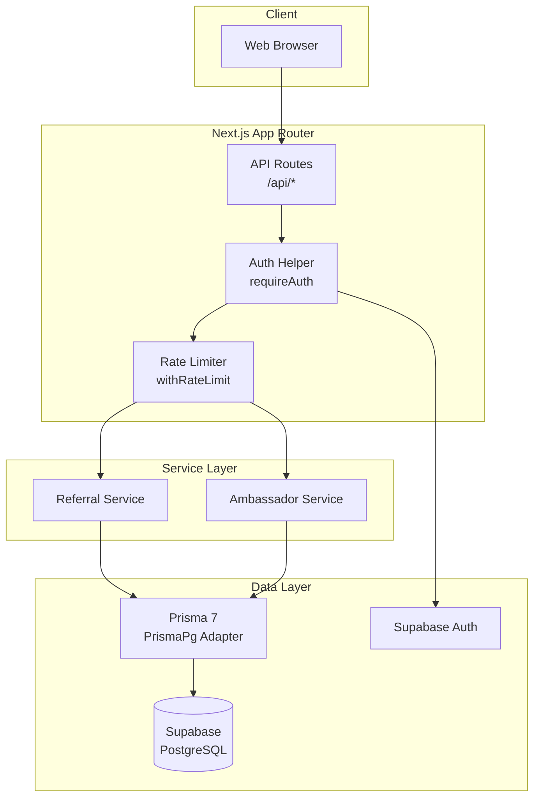
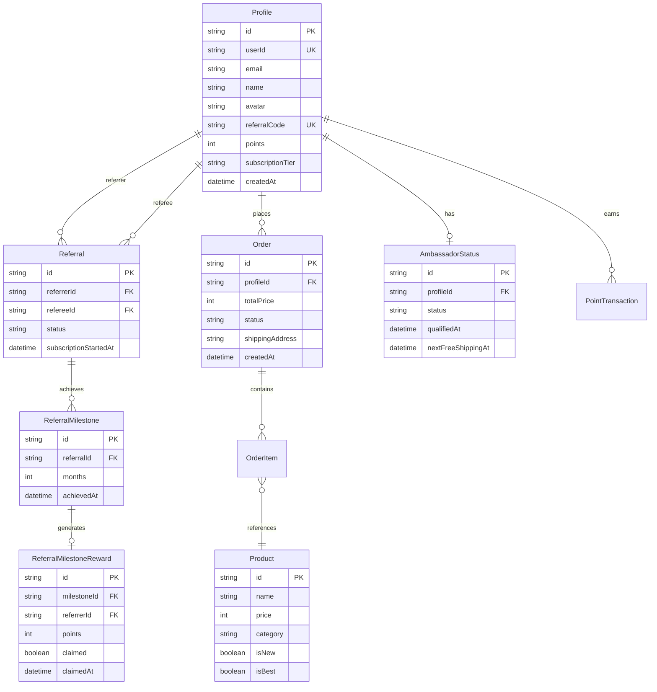
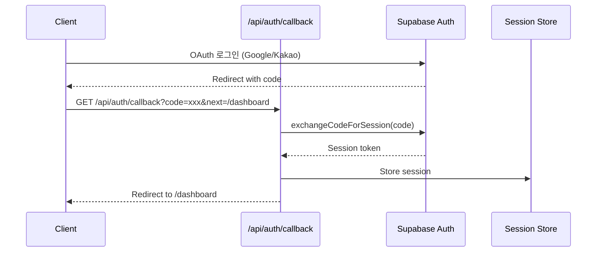

# Design: backend-api-spec

> Generated: 2025-12-25
> Status: Generated
> Language: ko

## 1. 아키텍처 개요

### 1.1 시스템 다이어그램



### 1.2 계층 구조

| 계층 | 책임 | 위치 |
|------|------|------|
| **API Route** | HTTP 요청/응답 처리, 라우팅 | `app/api/**/*.ts` |
| **Auth/Middleware** | 인증, Rate Limiting, 검증 | `lib/api/*.ts` |
| **Service** | 비즈니스 로직 | `lib/services/*.ts` |
| **Data Access** | 데이터베이스 작업 | `lib/prisma.ts` |

---

## 2. 컴포넌트 설계

### 2.1 API Routes 구조

```
app/api/
├── auth/
│   └── callback/route.ts          # OAuth 콜백
├── users/
│   └── me/
│       ├── route.ts               # GET/PATCH 프로필
│       └── measurements/route.ts  # GET/PATCH/DELETE 측정
├── products/
│   ├── route.ts                   # GET 목록
│   └── [id]/route.ts              # GET 상세
├── orders/
│   └── route.ts                   # GET/POST
├── referrals/
│   ├── code/route.ts              # GET 코드
│   ├── stats/route.ts             # GET 통계
│   ├── validate/route.ts          # POST 검증
│   ├── claim/route.ts             # POST 수령
│   ├── milestones/
│   │   ├── route.ts               # GET 현황
│   │   └── check/route.ts         # POST 체크
│   └── ambassador/route.ts        # GET 상태
├── ambassador/
│   └── free-shipping/route.ts     # GET/POST
└── cron/
    └── referral-milestones/route.ts  # GET
```

### 2.2 Service Layer 인터페이스

#### ReferralService

```typescript
interface ReferralService {
  // 추천 코드
  generateReferralCode(userId: string): Promise<string>;
  getReferralCode(userId: string): Promise<ReferralCodeResult>;
  validateReferralCode(code: string): Promise<ValidationResult>;

  // 마일스톤
  checkMilestonesForReferral(referralId: string): Promise<MilestoneCheckResult>;
  checkAllActiveMilestones(): Promise<BatchCheckResult>;
  getMilestoneStatus(userId: string): Promise<MilestoneStatus>;

  // 보상
  claimMilestoneReward(userId: string, rewardId: string): Promise<ClaimResult>;
  getUnclaimedRewards(userId: string): Promise<ReferralMilestoneReward[]>;

  // 통계
  getReferralStats(userId: string): Promise<ReferralStats>;
}
```

#### AmbassadorService

```typescript
interface AmbassadorService {
  // 자격
  checkAmbassadorQualification(userId: string): Promise<AmbassadorQualification>;
  updateAmbassadorStatus(userId: string): Promise<AmbassadorStatus>;
  updateAllAmbassadorStatuses(): Promise<BatchUpdateResult>;

  // 상태 & 혜택
  getAmbassadorStatus(userId: string): Promise<AmbassadorStatusResponse>;
  getAmbassadorBenefits(userId: string): Promise<AmbassadorBenefits>;

  // 무료 배송
  checkFreeShippingAvailability(userId: string): Promise<FreeShippingAvailability>;
  useFreeShipping(userId: string): Promise<UseFreeShippingResult>;
}
```

### 2.3 Utility/Helper 인터페이스

#### Auth Helper (`lib/api/auth.ts`)

```typescript
// 타입
interface AuthResult {
  user: {
    id: string;
    email: string;
  } | null;
  error: {
    message: string;
    status: number;
  } | null;
}

interface ApiResponse<T> {
  success: boolean;
  data?: T;
  error?: string;
  code?: string;
}

// 함수
async function requireAuth(): Promise<AuthResult>;
function apiError(message: string, status?: number, code?: string): NextResponse;
function apiSuccess<T>(data: T, status?: number): NextResponse;
```

#### Rate Limiter (`lib/api/rate-limit.ts`)

```typescript
interface RateLimitConfig {
  maxRequests: number;
  windowMs: number;
}

interface RateLimitResult {
  allowed: boolean;
  remaining: number;
  resetAt: Date;
}

async function withRateLimit(
  configKey: string,
  identifier?: string
): Promise<RateLimitResult>;
```

---

## 3. 데이터 모델

### 3.1 ER 다이어그램



### 3.2 핵심 모델 설명

| 모델 | 용도 | 주요 필드 |
|------|------|-----------|
| **Profile** | 사용자 프로필 | referralCode, points, subscriptionTier |
| **Referral** | 추천 관계 A→B | referrer, referee, status, subscriptionStartedAt |
| **ReferralMilestone** | 마일스톤 달성 | referral, months, achievedAt |
| **ReferralMilestoneReward** | 보상 기록 | milestone, referrer, points, claimed |
| **AmbassadorStatus** | 앰버서더 상태 | profile, status, nextFreeShippingAt |

---

## 4. API 설계

### 4.1 엔드포인트 요약

| Domain | Endpoint | Method | Auth | Rate Limit |
|--------|----------|--------|------|------------|
| **Auth** | /api/auth/callback | GET | No | - |
| **Users** | /api/users/me | GET | Yes | default |
| | /api/users/me | PATCH | Yes | default |
| | /api/users/me/measurements | GET | Yes | default |
| | /api/users/me/measurements | PATCH | Yes | default |
| | /api/users/me/measurements | DELETE | Yes | default |
| **Products** | /api/products | GET | No | - |
| | /api/products/[id] | GET | No | - |
| **Orders** | /api/orders | GET | Yes | default |
| | /api/orders | POST | Yes | orders |
| **Referrals** | /api/referrals/code | GET | Yes | default |
| | /api/referrals/stats | GET | Yes | default |
| | /api/referrals/validate | POST | No | auth |
| | /api/referrals/claim | POST | Yes | default |
| | /api/referrals/milestones | GET | Yes | default |
| | /api/referrals/milestones/check | POST | Cron | - |
| | /api/referrals/ambassador | GET | Yes | default |
| **Ambassador** | /api/ambassador/free-shipping | GET | Yes | default |
| | /api/ambassador/free-shipping | POST | Yes | default |
| **Cron** | /api/cron/referral-milestones | GET | Cron | - |

### 4.2 요청/응답 패턴

#### 성공 응답

```json
{
  "success": true,
  "data": { ... }
}
```

#### 에러 응답

```json
{
  "success": false,
  "error": "에러 메시지",
  "code": "ERROR_CODE"
}
```

#### 페이지네이션 응답 (Products)

```json
{
  "success": true,
  "data": [...],
  "count": 150,
  "pagination": {
    "page": 1,
    "limit": 20,
    "totalPages": 8
  }
}
```

---

## 5. 보안 설계

### 5.1 인증 플로우



### 5.2 Rate Limiting 전략

```
┌────────────────────────────────────────────────────┐
│ Rate Limit 설정                                    │
├────────────────────────────────────────────────────┤
│ auth     │ 5 req/min   │ 추천 코드 검증 (Brute Force)│
│ orders   │ 10 req/min  │ 주문 생성                  │
│ default  │ 30 req/min  │ 기타 모든 엔드포인트        │
├────────────────────────────────────────────────────┤
│ 저장소: 메모리 (Map)                               │
│ 키: userId 또는 IP                                 │
│ 윈도우: 슬라이딩 윈도우                            │
└────────────────────────────────────────────────────┘
```

### 5.3 입력 검증 전략

```typescript
// 1. Zod 스키마 정의
const schema = z.object({...});

// 2. API Route에서 검증
const body = await request.json();
const result = schema.safeParse(body);

if (!result.success) {
  return apiError(result.error.issues[0].message, 400);
}

// 3. 검증된 데이터 사용
const validData = result.data;
```

### 5.4 보안 체크리스트

| 위협 | 방어 | 구현 위치 |
|------|------|-----------|
| 인증 우회 | requireAuth() | 모든 보호 엔드포인트 |
| CSRF | SameSite Cookie | Supabase Auth |
| XSS | 입력 필터링 | 프로필 name 필드 |
| SSRF | URL 화이트리스트 | 아바타 URL |
| Open Redirect | next 파라미터 검증 | OAuth 콜백 |
| Brute Force | Rate Limiting | 추천 코드 검증 |
| Injection | Prisma 파라미터화 | 모든 DB 쿼리 |

---

## 6. 요구사항 추적 매트릭스

| Req ID | 요구사항 | 구현 파일 | 테스트 시나리오 |
|--------|----------|-----------|-----------------|
| 1.1 | OAuth 콜백 처리 | api/auth/callback/route.ts | 4개 Gherkin |
| 2.1 | 프로필 조회 | api/users/me/route.ts GET | 4개 Gherkin |
| 2.2 | 프로필 수정 | api/users/me/route.ts PATCH | 5개 Gherkin |
| 2.3 | 측정 조회 | api/users/me/measurements/route.ts GET | 2개 Gherkin |
| 2.4 | 측정 수정 | api/users/me/measurements/route.ts PATCH | 4개 Gherkin |
| 2.5 | 측정 삭제 | api/users/me/measurements/route.ts DELETE | 1개 Gherkin |
| 3.1 | 상품 목록 | api/products/route.ts | 8개 Gherkin |
| 3.2 | 상품 상세 | api/products/[id]/route.ts | 2개 Gherkin |
| 4.1 | 주문 목록 | api/orders/route.ts GET | 2개 Gherkin |
| 4.2 | 주문 생성 | api/orders/route.ts POST | 6개 Gherkin |
| 5.1 | 추천 코드 | api/referrals/code/route.ts | 2개 Gherkin |
| 5.2 | 추천 통계 | api/referrals/stats/route.ts | 1개 Gherkin |
| 5.3 | 코드 검증 | api/referrals/validate/route.ts | 4개 Gherkin |
| 5.4 | 보상 수령 | api/referrals/claim/route.ts | 3개 Gherkin |
| 5.5 | 마일스톤 현황 | api/referrals/milestones/route.ts | 2개 Gherkin |
| 5.6 | 마일스톤 체크 | api/referrals/milestones/check/route.ts | 3개 Gherkin |
| 5.7 | 앰버서더 상태 | api/referrals/ambassador/route.ts | 3개 Gherkin |
| 6.1 | 무료 배송 조회 | api/ambassador/free-shipping/route.ts GET | 2개 Gherkin |
| 6.2 | 무료 배송 사용 | api/ambassador/free-shipping/route.ts POST | 2개 Gherkin |
| 7.1 | 크론 작업 | api/cron/referral-milestones/route.ts | 3개 Gherkin |
| C1 | 인증 | lib/api/auth.ts | 1개 Gherkin |
| C2 | Rate Limiting | lib/api/rate-limit.ts | 3개 Gherkin |
| C3 | 입력 검증 | Zod schemas | 2개 Gherkin |
| C4 | 보안 | 각 엔드포인트 | 3개 Gherkin |
| C5 | 응답 형식 | lib/api/auth.ts | 2개 Gherkin |

---

## 7. TDD 테스트 전략

### 7.1 테스트 피라미드

```
          ╱╲
         ╱  ╲
        ╱ E2E ╲         5%  - 핵심 사용자 플로우
       ╱──────╲
      ╱        ╲
     ╱ Integration ╲    25% - API 엔드포인트
    ╱──────────────╲
   ╱                ╲
  ╱    Unit Tests    ╲  70% - Services, Helpers
 ╱────────────────────╲
```

### 7.2 Unit Test 대상

| 컴포넌트 | 테스트 초점 | 우선순위 |
|----------|-------------|----------|
| ReferralService | 코드 생성, 마일스톤 계산, 보상 수령 | 높음 |
| AmbassadorService | 자격 확인, 무료 배송 로직 | 높음 |
| Auth Helper | requireAuth 반환값, 응답 포맷 | 중간 |
| Rate Limiter | 윈도우 계산, 제한 로직 | 중간 |
| Zod Schemas | 유효성 검증 케이스 | 높음 |

### 7.3 Integration Test 전략

```typescript
// 테스트 셋업
beforeAll(async () => {
  await setupTestDatabase();
  await seedTestData();
});

afterEach(async () => {
  await cleanupTestData();
});

// 테스트 예시
describe('POST /api/orders', () => {
  it('should create order with valid items', async () => {
    // Given
    const user = await createTestUser();
    const products = await createTestProducts(2);

    // When
    const response = await POST('/api/orders', {
      auth: user,
      body: {
        items: products.map(p => ({ productId: p.id, quantity: 1 })),
        shippingAddress: '서울시 강남구'
      }
    });

    // Then
    expect(response.status).toBe(201);
    expect(response.body.success).toBe(true);
    expect(response.body.data.orderItems).toHaveLength(2);
  });
});
```

### 7.4 TDD 사이클 적용

```
각 요구사항에 대해:

1. 🔴 RED: Gherkin 시나리오를 테스트 코드로 변환
   - requirements.md의 Acceptance Criteria 참조
   - 테스트 실행 → 실패 확인

2. 🟢 GREEN: 최소한의 구현
   - 테스트를 통과시키는 코드 작성
   - 과도한 구현 금지

3. 🔵 REFACTOR: 코드 개선
   - 중복 제거
   - 패턴 적용
   - 테스트 재실행 → 통과 확인
```

---

## 8. 구현 순서 권장

### Phase 1: 인프라 (0단계)

1. 테스트 환경 설정 (Vitest, Test DB)
2. Auth Helper 테스트 및 리팩토링
3. Rate Limiter 테스트 및 리팩토링

### Phase 2: 핵심 도메인 (1단계)

1. Users API 테스트 (프로필, 측정)
2. Products API 테스트 (목록, 상세)
3. Orders API 테스트 (조회, 생성)

### Phase 3: 추천 시스템 (2단계)

1. ReferralService 단위 테스트
2. Referrals API 통합 테스트
3. 마일스톤 로직 테스트

### Phase 4: 앰버서더 (3단계)

1. AmbassadorService 단위 테스트
2. Ambassador API 통합 테스트
3. Cron 작업 테스트

---

## Notes

- 이 문서는 `/kiro:spec-design backend-api-spec -y`로 생성됨
- requirements.md 기반 아키텍처 설계
- 다음 단계: `/kiro:spec-tasks backend-api-spec`으로 태스크 분해
