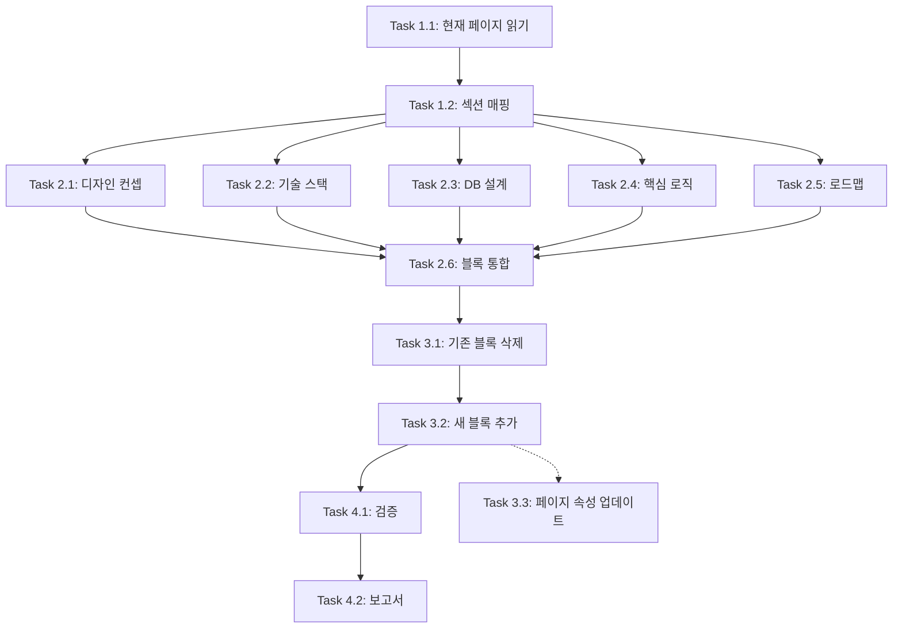

# Notion 기술 스택 페이지 갱신 워크플로우

**작성일**: 2025-11-19
**전략**: Full Migration (Approach #1)
**목표**: 새 기획서 내용을 Notion 🔧 기술 스택 페이지에 완전히 반영

---

## 📊 전체 개요

### 목표 (Objectives)
1. 새 기획서의 5개 섹션을 Notion 페이지 구조로 완전 재구성
2. 디자인 컨셉, 간소화된 기술 스택, DB 설계, 핵심 로직, 로드맵 모두 반영
3. 기존 유효 정보 보존 + 신규 정보 통합
4. SSOT (Single Source of Truth) 원칙 준수

### 성공 기준 (Success Criteria)
- ✅ 5개 섹션 모두 Notion에 반영
- ✅ 코드 블록, 테이블, 리스트 등 서식 정확히 적용
- ✅ 기존 페이지 ID 유지 (링크 깨지지 않음)
- ✅ 검증 완료 및 보고서 생성

---

## 🗺️ Phase 구조

### Phase 1: Discovery & Analysis (현황 분석)
**목표**: 현재 Notion 페이지 구조 파악 및 갱신 범위 확정
**예상 시간**: 10분
**복잡도**: ⭐☆☆☆☆

### Phase 2: Content Preparation (콘텐츠 준비)
**목표**: 새 기획서 내용을 Notion API 형식으로 변환
**예상 시간**: 20분
**복잡도**: ⭐⭐⭐☆☆

### Phase 3: Notion Update (페이지 갱신)
**목표**: Notion API를 통한 실제 페이지 업데이트
**예상 시간**: 15분
**복잡도**: ⭐⭐⭐⭐☆

### Phase 4: Validation & Reporting (검증 및 보고)
**목표**: 업데이트 결과 검증 및 보고서 작성
**예상 시간**: 10분
**복잡도**: ⭐⭐☆☆☆

**전체 예상 시간**: 약 55분
**전체 복잡도**: ⭐⭐⭐☆☆ (중간)

---

## 📋 Phase 1: Discovery & Analysis

### Task 1.1: 현재 Notion 페이지 읽기 (필수)
**의존성**: 없음
**병렬 가능**: ❌ (후속 작업의 기반)

**작업 내용**:
1. Notion API로 🔧 기술 스택 페이지 조회
   - Page ID: `2ac77770-ad42-8193-bd55-df8586d12aa7`
2. 현재 block 구조 분석
3. 기존 콘텐츠 중 유지할 내용 식별

**산출물**:
- 현재 페이지 구조 맵
- 보존할 콘텐츠 목록

**리스크**:
- ⚠️ 페이지가 다른 곳으로 이동되었을 가능성
- **완화**: Page ID로 직접 조회하여 위치 무관하게 접근

---

### Task 1.2: 기획서 섹션 매핑 (필수)
**의존성**: Task 1.1 완료 후
**병렬 가능**: ❌

**작업 내용**:
1. 새 기획서 5개 섹션 분석
2. 각 섹션을 Notion block 구조로 매핑
3. 콘텐츠 변환 규칙 정의
   - 제목 → heading block
   - 코드 → code block
   - 리스트 → bulleted_list_item

**산출물**:
- 섹션별 block 구조 설계서

**리스크**:
- ⚠️ Notion block 타입 제약 (일부 서식 지원 안 될 수 있음)
- **완화**: 지원되는 block 타입으로 대체 (예: 표 → bulleted list)

---

## 📋 Phase 2: Content Preparation

### Task 2.1: 섹션 1 - 디자인 컨셉 준비 (병렬 가능)
**의존성**: Task 1.2 완료 후
**병렬 가능**: ✅ (Task 2.2~2.5와 동시 진행)

**작업 내용**:
1. Heading: "1. 🎨 디자인 컨셉: '디지털 테디베어 하우스'"
2. Quote block: "Core Theme: Soft, Cozy, Pastel"
3. Code block: 컬러 팔레트 (#F5E6D3, #8D6E63 등)
4. Bulleted list: UI Shape, Font 설명

**Notion block 구조**:
```json
[
  { "type": "heading_1", "heading_1": { "rich_text": [{ "text": { "content": "1. 🎨 디자인 컨셉: '디지털 테디베어 하우스'" } }] } },
  { "type": "quote", "quote": { "rich_text": [{ "text": { "content": "Core Theme: Soft, Cozy, Pastel" } }] } },
  { "type": "code", "code": { "rich_text": [{ "text": { "content": "Primary: #F5E6D3 (라떼 베이지)\n..." } }], "language": "plain text" } },
  ...
]
```

---

### Task 2.2: 섹션 2 - 기술 스택 준비 (병렬 가능)
**의존성**: Task 1.2 완료 후
**병렬 가능**: ✅

**작업 내용**:
1. Heading: "2. 🛠 간소화된 최종 기술 스택 (Lite Version)"
2. Toggle block: "Framework", "Database & Auth", "State Management" 등
3. Callout block: TanStack Query 제거 강조 (⚠️ 아이콘)

**중요 포인트**:
- ⚠️ **변경 사항 하이라이트**: "TanStack Query 제거" → Callout으로 강조
- Zustand 조건부 사용 설명 추가

---

### Task 2.3: 섹션 3 - DB 설계 준비 (병렬 가능)
**의존성**: Task 1.2 완료 후
**병렬 가능**: ✅

**작업 내용**:
1. Heading: "3. 🗄️ 데이터베이스 설계 (보안 강화 및 구독)"
2. Sub-heading: "A. user_body_profiles", "B. product_size_specs", "C. subscriptions"
3. Code block: 각 테이블 스키마 (SQL 또는 pseudo-code)

**Notion 제약 대응**:
- 테이블 스키마는 code block으로 표현 (Notion table은 복잡도 높음)

---

### Task 2.4: 섹션 4 - 핵심 로직 준비 (병렬 가능)
**의존성**: Task 1.2 완료 후
**병렬 가능**: ✅

**작업 내용**:
1. Heading: "4. ⚙️ 핵심 로직 상세 (Logic Spec)"
2. Sub-heading: "A. 스마트 사이즈 추천", "B. 구독 결제 시스템"
3. Numbered list: 각 로직의 단계별 설명
4. Code block: 의사 코드 (pseudo-code)

---

### Task 2.5: 섹션 5 - 로드맵 준비 (병렬 가능)
**의존성**: Task 1.2 완료 후
**병렬 가능**: ✅

**작업 내용**:
1. Heading: "5. 🗓️ 1인 개발 최적화 로드맵 (1주 단위)"
2. Toggle blocks: "Week 1: 집 짓기", "Week 2: 옷장 채우기" 등
3. Checkbox list: 각 주의 체크리스트 항목

**Notion block 구조**:
```json
[
  { "type": "heading_1", "heading_1": { "rich_text": [{ "text": { "content": "5. 🗓️ 1인 개발 최적화 로드맵" } }] } },
  { "type": "toggle", "toggle": {
      "rich_text": [{ "text": { "content": "Week 1: 집 짓기" } }],
      "children": [
        { "type": "to_do", "to_do": { "rich_text": [{ "text": { "content": "Next.js + Supabase 세팅" } }], "checked": false } },
        ...
      ]
  } }
]
```

---

### Task 2.6: 전체 블록 배열 통합 (필수)
**의존성**: Task 2.1~2.5 모두 완료 후
**병렬 가능**: ❌

**작업 내용**:
1. 5개 섹션의 block 배열을 하나로 병합
2. Notion API `append_block_children` 형식으로 최종 변환
3. 기존 유지 콘텐츠가 있다면 적절한 위치에 삽입

**산출물**:
- 최종 Notion block 배열 (JSON)

**리스크**:
- ⚠️ Notion API block 개수 제한 (한 번에 100개까지)
- **완화**: 섹션별로 나눠서 여러 번 요청

---

## 📋 Phase 3: Notion Update

### Task 3.1: 기존 블록 삭제 (선택적)
**의존성**: Task 2.6 완료 후
**병렬 가능**: ❌

**작업 내용**:
1. 현재 페이지의 모든 child blocks 조회
2. 필요 시 기존 블록 삭제 (clean slate 접근)
   - 또는 특정 섹션만 선택적 삭제

**대안**:
- 기존 블록 유지하고 새 블록을 append (누적 방식)
- **권장**: Clean slate (명확한 구조를 위해)

**리스크**:
- ⚠️ 실수로 삭제 시 복구 어려움
- **완화**: 삭제 전 기존 콘텐츠 백업 (Read 결과 저장)

---

### Task 3.2: 새 블록 추가 (필수)
**의존성**: Task 3.1 완료 후 (또는 skip)
**병렬 가능**: ❌ (순차 진행 필요)

**작업 내용**:
1. `mcp__notion__API-patch-block-children` 호출
2. 5개 섹션 블록을 한 번에 또는 섹션별로 추가
3. 각 섹션 업데이트 후 결과 확인

**API 호출 예시**:
```typescript
mcp__notion__API-patch-block-children({
  block_id: '2ac77770-ad42-8193-bd55-df8586d12aa7',
  children: [
    { type: 'heading_1', heading_1: { ... } },
    { type: 'paragraph', paragraph: { ... } },
    ...
  ]
})
```

**리스크**:
- ⚠️ API 오류 (잘못된 block 형식, 권한 문제)
- **완화**: 작은 블록부터 테스트 후 전체 업데이트

---

### Task 3.3: 페이지 속성 업데이트 (선택적)
**의존성**: Task 3.2 완료 후
**병렬 가능**: ✅ (Task 3.2와 독립적)

**작업 내용**:
1. 페이지 타이틀 업데이트 (필요 시)
2. 페이지 아이콘, 커버 이미지 설정 (선택적)

**현재 타이틀**: "🔧 기술 스택"
**변경 필요**: ❌ (그대로 유지)

---

## 📋 Phase 4: Validation & Reporting

### Task 4.1: 업데이트 검증 (필수)
**의존성**: Task 3.2 완료 후
**병렬 가능**: ❌

**작업 내용**:
1. Notion API로 업데이트된 페이지 다시 읽기
2. 5개 섹션이 모두 존재하는지 확인
3. 주요 콘텐츠 샘플링 검증
   - 디자인 컨셉 컬러 팔레트 존재 확인
   - TanStack Query 제거 문구 존재 확인
   - 로드맵 Week 1~4 존재 확인

**검증 체크리스트**:
- ✅ 섹션 1: 디자인 컨셉 존재
- ✅ 섹션 2: 간소화된 기술 스택 존재
- ✅ 섹션 3: DB 설계 존재
- ✅ 섹션 4: 핵심 로직 존재
- ✅ 섹션 5: 로드맵 존재

---

### Task 4.2: 보고서 작성 (필수)
**의존성**: Task 4.1 완료 후
**병렬 가능**: ❌

**작업 내용**:
1. `claudedocs/tech_stack_update_report_2025-11-19.md` 생성
2. 업데이트 내용 요약
3. 변경 사항 상세 (Before/After)
4. 검증 결과
5. 다음 단계 권장사항

**보고서 구조**:
```markdown
# Notion 기술 스택 페이지 업데이트 보고서

## 업데이트 개요
- 날짜: 2025-11-19
- 대상: 🔧 기술 스택 페이지
- 전략: Full Migration

## 변경 사항
### 신규 추가
- 디자인 컨셉 섹션 (완전 신규)
- ...

### 수정
- TanStack Query 제거 강조
- ...

## 검증 결과
- ✅ 모든 섹션 정상 반영
- ✅ ...

## 다음 단계
- 개발 환경 설정 시작
- ...
```

---

## 🎯 Dependencies Map (의존성 맵)



**병렬 실행 가능 그룹**:
- **Group 1**: Task 2.1, 2.2, 2.3, 2.4, 2.5 (5개 섹션 동시 준비)
- **Group 2**: Task 3.2, 3.3 (블록 추가와 속성 업데이트)

---

## ⚠️ Risks & Mitigation (리스크 및 완화)

### Risk 1: Notion API 권한 문제
**확률**: 중간
**영향**: 높음 (작업 중단)
**완화**:
- API 호출 전 인증 상태 확인
- 페이지 ID 정확성 검증

### Risk 2: Block 형식 오류
**확률**: 높음
**영향**: 중간 (일부 섹션 누락)
**완화**:
- 작은 블록부터 테스트
- 섹션별로 나눠서 업데이트
- 오류 발생 시 해당 섹션만 재시도

### Risk 3: 기존 콘텐츠 손실
**확률**: 낮음
**영향**: 높음
**완화**:
- Task 1.1에서 기존 콘텐츠 백업
- 삭제 전 중요 정보 확인

### Risk 4: Notion API 제한 (Rate Limit)
**확률**: 낮음
**영향**: 중간 (작업 지연)
**완화**:
- API 호출 간 적절한 간격 유지
- 대량 블록은 여러 번 나눠서 전송

---

## 📊 Effort Estimation (노력 예측)

### 개발자 시간
| Phase | 예상 시간 | 실제 시간 (기록용) |
|-------|----------|-------------------|
| Phase 1: Discovery | 10분 | |
| Phase 2: Preparation | 20분 | |
| Phase 3: Update | 15분 | |
| Phase 4: Validation | 10분 | |
| **Total** | **55분** | |

### 복잡도 분석
| 작업 유형 | 복잡도 | 이유 |
|----------|--------|------|
| Notion API 호출 | ⭐⭐⭐⭐☆ | Block 구조 정확히 맞춰야 함 |
| 콘텐츠 변환 | ⭐⭐⭐☆☆ | 반복적이지만 신중해야 함 |
| 검증 | ⭐⭐☆☆☆ | 읽기 작업 위주 |
| 보고서 작성 | ⭐☆☆☆☆ | 템플릿 기반 작성 |

---

## ✅ Next Steps (다음 단계)

1. **즉시 실행**: Task 1.1 - 현재 Notion 페이지 읽기
2. **준비**: Notion block 구조 템플릿 작성
3. **실행**: Phase 2 Task 그룹 병렬 실행
4. **검증**: Phase 4 체크리스트 확인

---

**워크플로우 작성 완료**
**작성자**: Claude Code
**작성 일시**: 2025-11-19
**문서 버전**: v1.0
