# TeddyBearsRoom Architecture Document

> **Last Updated**: 2026-02-28
> **Live**: https://teddybearsroom.com
> **Repository**: [Luchello/TeddyBearsRoom](https://github.com/Luchello/TeddyBearsRoom)

---

## 1. 프로젝트 개요

### 1.1 소개

TeddyBear'sRoom은 성인용 셀프케어 상품을 큐레이팅하는 프라이버시 중심 이커머스 플랫폼이다.
"지뢰계(Jirai-kei) 감성 프라이빗 셀프케어"를 슬로건으로, 구독 멤버십 · 스마트 사이즈 추천 · 기부 투표라는 세 가지 차별화 축을 갖는다.

### 1.2 기술 스택

| Layer | Technology | Version |
|-------|-----------|---------|
| Framework | Next.js (App Router) | 16.1.6 |
| UI Library | React | 19.2.0 |
| Language | TypeScript | 5.x |
| Styling | Tailwind CSS | 4.x |
| Components | shadcn/ui + Radix UI | latest |
| State | Zustand | 5.0.8 |
| ORM | Prisma | 7.0.1 |
| Database | PostgreSQL (Supabase) | 15 |
| Auth | Supabase Auth | 2.86.0 |
| Icons | lucide-react | 0.555.0 |
| Hosting | Vercel | — |
| Domain | teddybearsroom.com | — |

### 1.3 차별화 기능

| 기능 | 설명 | 상태 |
|------|------|------|
| 구독 멤버십 (Roommate) | 9,900원/월, 10% 상시할인, 1% 기부, 3만원↑ 무료배송 | ✅ UI 완료 |
| 스마트 사이즈 추천 | pgcrypto 바이너리 암호화 + Pass/Fail 매칭 | ✅ 스키마 완료 |
| 기부 투표 | 구독자가 매월 기부처를 투표로 결정 | ✅ UI 완료 |

### 1.4 법적 요구사항

- **청소년보호법**: 성인 상품 판매 시 19세 이상 본인인증 의무
- **정보통신망법**: 개인정보 수집·이용 동의, 암호화 저장
- **개인정보보호법**: 신체 측정 데이터 암호화(bytea), 최소 수집 원칙
- **전자상거래법**: 청약 철회, 주문 확인, 환불 절차

---

## 2. 시스템 아키텍처

### 2.1 고수준 시스템 아키텍처

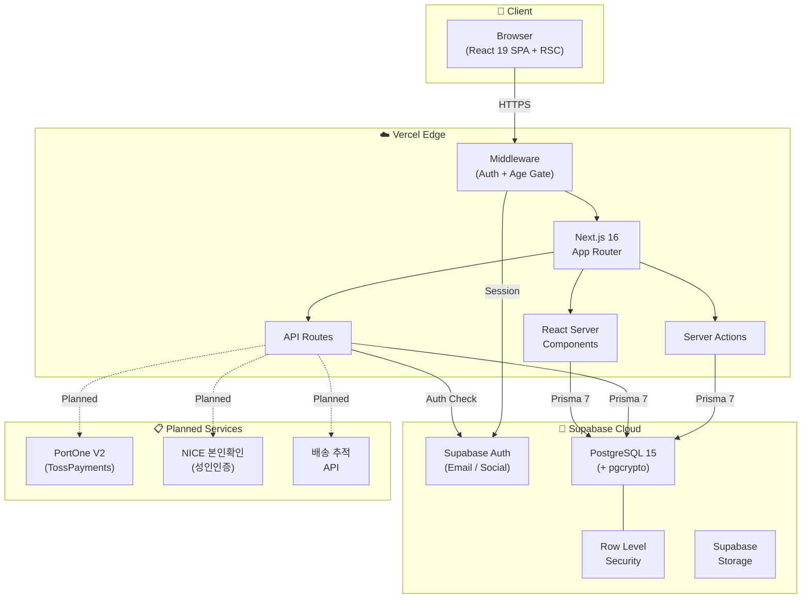

### 2.2 컴포넌트 아키텍처

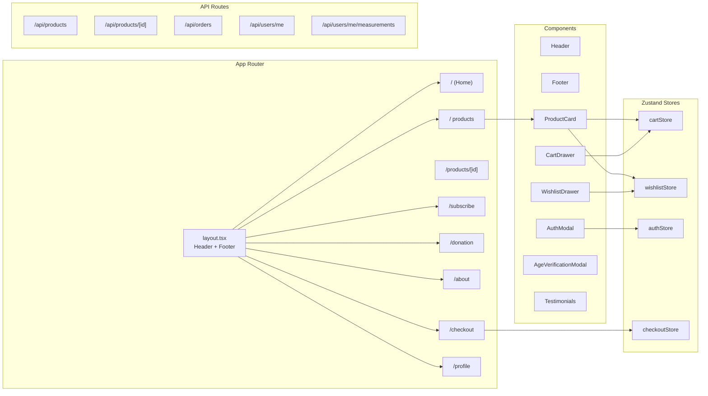

### 2.3 데이터 흐름

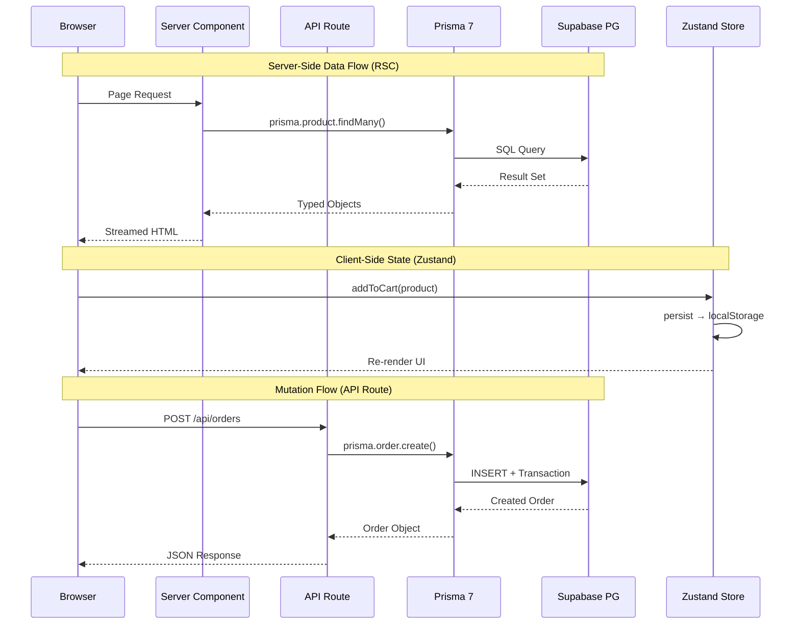

---

## 3. 프로젝트 디렉토리 구조

```
TeddyBearsRoom/
├── CLAUDE.md                          # 프로젝트 가이드 (Claude Code)
├── claudedocs/                        # 전략, 리서치, 설계 문서 (13개)
├── docs/
│   └── architecture.md                # 본 문서
└── frontend/                          # Next.js 16 애플리케이션
    ├── prisma/
    │   ├── schema.prisma              # DB 스키마 (9개 핵심 모델)
    │   └── migrations/                # Migration 히스토리
    ├── prisma.config.ts               # Prisma 7 defineConfig
    ├── package.json                   # 의존성 관리
    ├── tailwind.config.ts             # Tailwind 4 설정
    ├── tsconfig.json                  # TypeScript 설정
    ├── public/
    │   ├── logo.png                   # 메인 로고
    │   ├── tbr_logo_dark.png          # 다크모드 로고
    │   └── favicon.png                # 파비콘
    └── src/
        ├── app/
        │   ├── layout.tsx             # 루트 레이아웃 (Header/Footer)
        │   ├── page.tsx               # 홈페이지
        │   ├── globals.css            # 디자인 시스템 v2.0
        │   ├── about/page.tsx         # 소개
        │   ├── products/
        │   │   ├── page.tsx           # 상품 목록
        │   │   └── [id]/page.tsx      # 상품 상세
        │   ├── subscribe/page.tsx     # 구독 멤버십
        │   ├── donation/page.tsx      # 기부 투표
        │   ├── checkout/page.tsx      # 결제
        │   ├── profile/page.tsx       # 마이페이지
        │   └── api/
        │       ├── products/
        │       │   ├── route.ts       # GET (목록) / POST (생성)
        │       │   └── [id]/route.ts  # GET / PUT / DELETE
        │       ├── orders/
        │       │   └── route.ts       # POST (주문 생성)
        │       └── users/
        │           └── me/
        │               ├── route.ts           # GET / PUT (프로필)
        │               └── measurements/
        │                   └── route.ts       # GET / PUT (신체 측정)
        ├── components/
        │   ├── Header.tsx             # 반응형 헤더 + 다크모드 로고 분기
        │   ├── Footer.tsx             # Wave Divider + 뉴스레터 + SNS
        │   ├── ProductCard.tsx        # 상품 카드 (위시리스트/장바구니)
        │   ├── ProductCardSkeleton.tsx
        │   ├── ProductFilter.tsx      # 필터 + 정렬
        │   ├── CartButton.tsx         # 장바구니 버튼
        │   ├── CartDrawer.tsx         # 장바구니 사이드바
        │   ├── WishlistButton.tsx     # 위시리스트 버튼
        │   ├── WishlistDrawer.tsx     # 위시리스트 사이드바
        │   ├── AuthModal.tsx          # 로그인/회원가입 모달
        │   ├── AgeVerificationModal.tsx # 성인 인증 모달 (UI 완료)
        │   ├── SizeMeasurementForm.tsx  # 신체 측정 입력 폼
        │   ├── PlanComparisonTable.tsx  # 비회원 vs Roommate 비교
        │   ├── FAQAccordion.tsx       # FAQ 아코디언
        │   ├── Testimonials.tsx       # 고객 후기 캐러셀
        │   └── ui/                    # shadcn/ui 컴포넌트
        │       ├── button.tsx
        │       ├── card.tsx
        │       ├── input.tsx
        │       ├── label.tsx
        │       ├── select.tsx
        │       ├── sheet.tsx
        │       ├── tabs.tsx
        │       └── latex-background.tsx # 다크모드 라텍스 광택 배경
        ├── contexts/
        │   └── ToastContext.tsx        # Toast 알림
        ├── hooks/                     # Custom hooks
        ├── lib/
        │   ├── data.ts               # 정적 데이터 (구독 플랜, FAQ 등)
        │   ├── encryption.ts         # pgcrypto 암호화 유틸
        │   ├── prisma.ts             # Prisma 싱글톤 클라이언트
        │   ├── types.ts              # 공통 타입 정의
        │   ├── utils.ts              # cn() 등 유틸리티
        │   └── supabase/
        │       ├── client.ts         # createBrowserClient
        │       ├── server.ts         # createServerClient
        │       └── middleware.ts     # Auth 미들웨어
        └── store/
            ├── authStore.ts          # 인증 상태
            ├── cartStore.ts          # 장바구니 (localStorage persist)
            ├── checkoutStore.ts      # 결제 프로세스 상태
            └── wishlistStore.ts      # 위시리스트 (localStorage persist)
```

### Planned Route Groups

| Route | 상태 | 설명 |
|-------|------|------|
| `/(shop)` | Planned | 상품, 카테고리, 검색 그룹핑 |
| `/(auth)` | Planned | 로그인, 회원가입, 비밀번호 재설정 |
| `/(admin)` | Planned | 관리자 대시보드 |
| `/api/payments/*` | Planned | 결제 Webhook, 환불 API |
| `/api/verification/*` | Planned | 성인인증 API |

---

## 4. 데이터베이스 스키마

### 4.1 커머스 도메인 ERD

> 기존 Prisma 스키마 기반. `ts_*` 테이블 (네이버 마켓 연동)은 범위에서 제외.

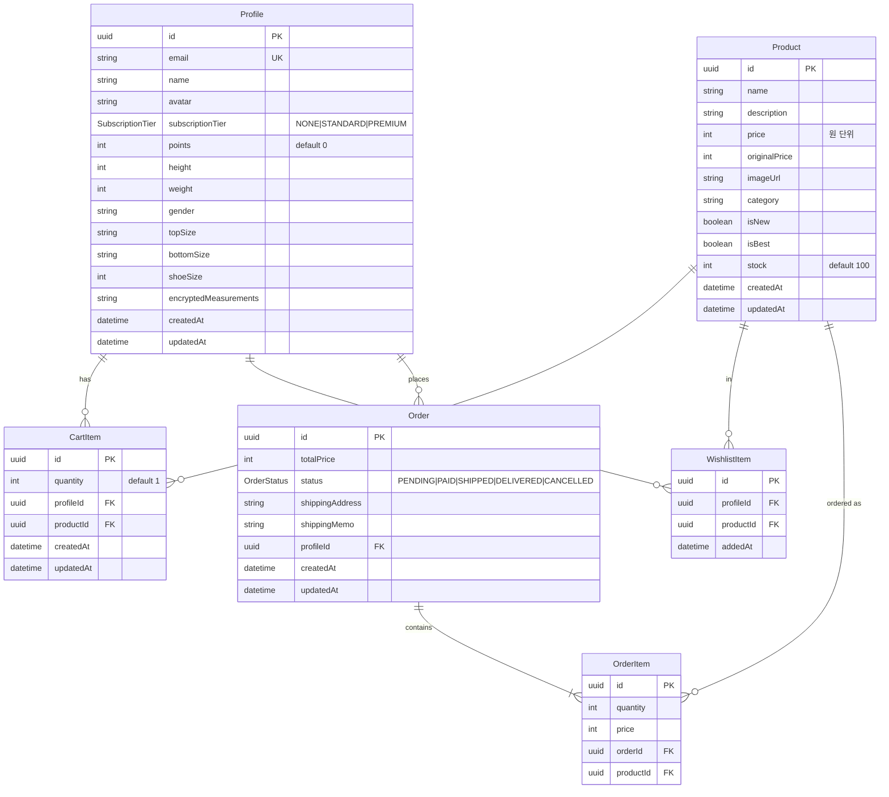

### 4.2 구독 · 기부 · 측정 도메인 ERD

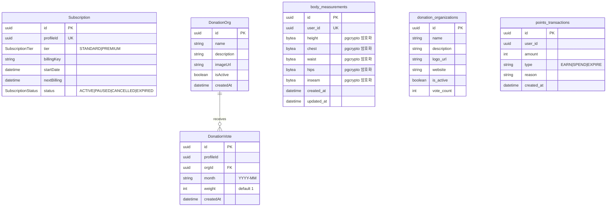

### 4.3 Unique 제약조건

| Model | Constraint | 목적 |
|-------|-----------|------|
| `CartItem` | `[profileId, productId]` | 사용자당 상품 1개 행 |
| `WishlistItem` | `[profileId, productId]` | 중복 위시리스트 방지 |
| `DonationVote` | `[profileId, month]` | 월 1회 투표 제한 |
| `Subscription` | `profileId` | 사용자당 구독 1개 |
| `body_measurements` | `user_id` | 사용자당 측정 1개 |

### 4.4 인덱스 전략

| 테이블 | 인덱스 | 용도 |
|--------|--------|------|
| `points_transactions` | `user_id`, `created_at` | 포인트 내역 조회 |

### 4.5 Planned 테이블

| 테이블 | 목적 | Phase |
|--------|------|-------|
| `payments` | PortOne 결제 기록 (merchant_uid, imp_uid, amount, status) | 1 |
| `refunds` | 환불 기록 (payment_id, reason, amount, status) | 1 |
| `age_verifications` | 성인인증 결과 (profile_id, ci, di, verified_at) | 1 |
| `reviews` | 상품 리뷰 (product_id, profile_id, rating, content) | 2 |
| `coupons` | 쿠폰 정의 (code, discount_type, discount_value, expires_at) | 2 |
| `coupon_usages` | 쿠폰 사용 기록 (coupon_id, profile_id, order_id) | 2 |
| `shipping_tracks` | 배송 추적 (order_id, carrier, tracking_no, status) | 2 |

---

## 5. 인증 아키텍처

### 5.1 현재: Supabase Auth

- **인증 방식**: 이메일/비밀번호 + 소셜 로그인 (Google, Kakao)
- **세션 관리**: Supabase SSR (`@supabase/ssr`)
  - `createBrowserClient()` — 클라이언트 컴포넌트
  - `createServerClient()` — 서버 컴포넌트, API Route
  - 미들웨어에서 세션 갱신
- **상태 관리**: `authStore` (Zustand) — 클라이언트 사이드 인증 상태 캐시

### 5.2 Planned: NICE 성인인증 (포트원 V2 통합)

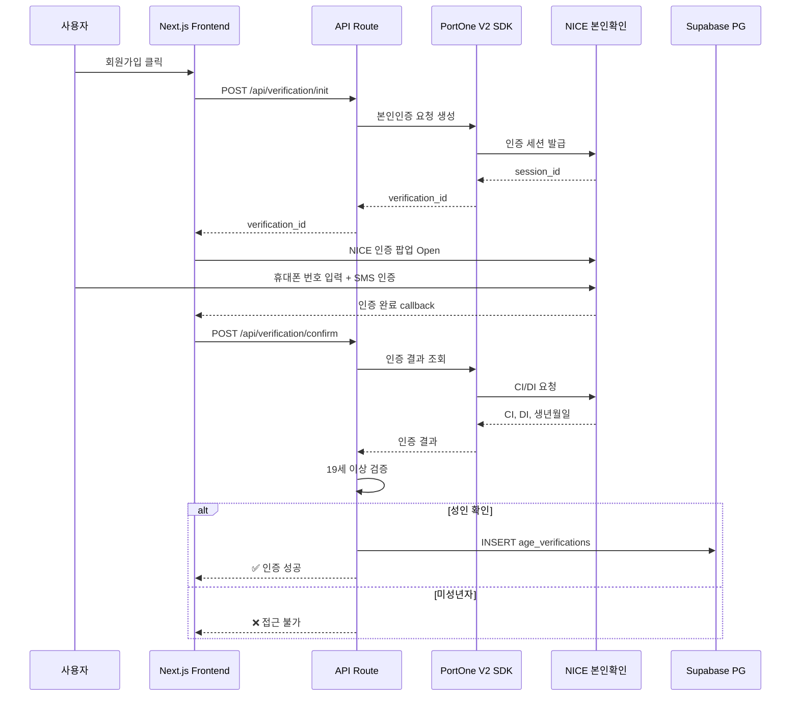

### 5.3 미들웨어 인증 체인

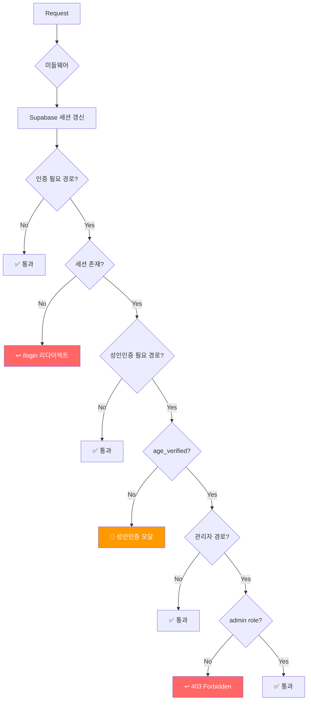

### 5.4 보호 경로

| 경로 | 인증 | 성인인증 | 비고 |
|------|------|---------|------|
| `/`, `/about`, `/products` | — | — | 공개 |
| `/products/[id]` | — | Planned | 상품 상세 (성인 상품) |
| `/checkout` | ✅ | Planned | 주문/결제 |
| `/profile` | ✅ | — | 마이페이지 |
| `/subscribe` | ✅ | — | 구독 관리 |
| `/donation` | ✅ | — | 기부 투표 |
| `/admin/*` | ✅ | — | Planned |

---

## 6. 결제 아키텍처

> **Status**: Planned (Phase 1)
> TossPayments SDK를 포트원 V2를 통해 연동할 예정.

### 6.1 결제 시스템 구조

- **PG사**: TossPayments (via PortOne V2)
- **일반 결제**: 카드, 계좌이체, 간편결제 (카카오페이, 토스페이)
- **구독 결제**: 빌링키(Billing Key) 기반 정기결제
- **Webhook**: 결제 상태 변경 → API Route → DB 업데이트
- **정기결제 스케줄러**: Vercel Cron → TossPayments API

### 6.2 결제 정상 흐름

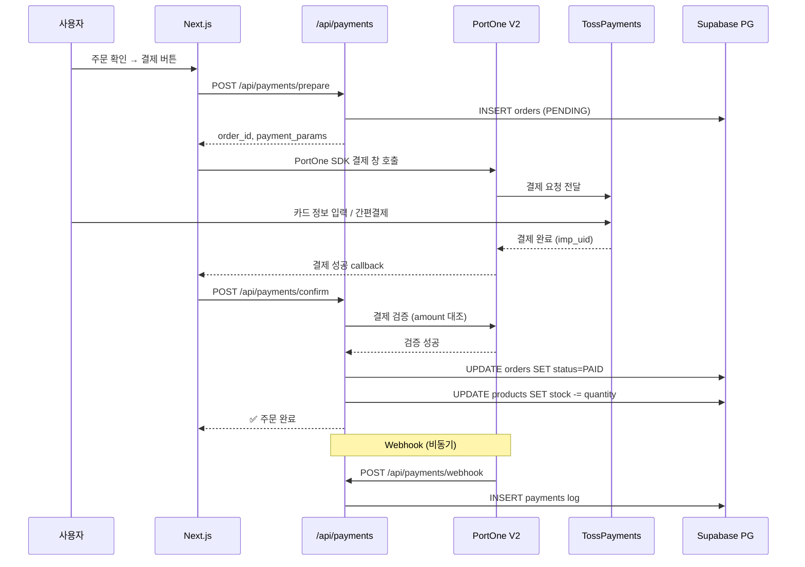

### 6.3 환불 흐름

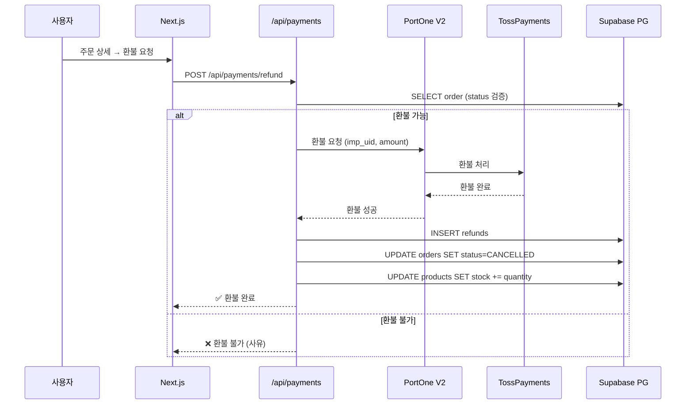

### 6.4 주문 상태 전이

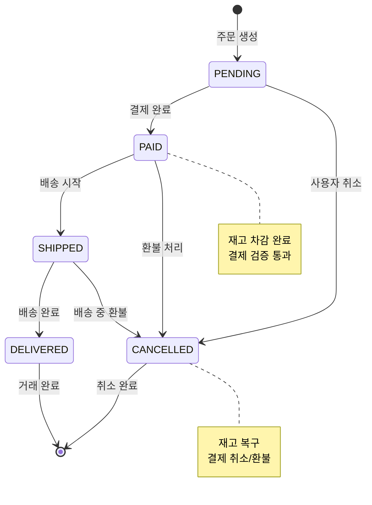

---

## 7. API 라우트 설계

### 7.1 현재 API Routes

| Method | Endpoint | 설명 | Auth |
|--------|----------|------|------|
| `GET` | `/api/products` | 상품 목록 (필터, 정렬, 페이지네이션) | — |
| `POST` | `/api/products` | 상품 생성 | Admin |
| `GET` | `/api/products/[id]` | 상품 상세 | — |
| `PUT` | `/api/products/[id]` | 상품 수정 | Admin |
| `DELETE` | `/api/products/[id]` | 상품 삭제 | Admin |
| `POST` | `/api/orders` | 주문 생성 (트랜잭션) | ✅ |
| `GET` | `/api/users/me` | 내 프로필 조회 | ✅ |
| `PUT` | `/api/users/me` | 내 프로필 수정 | ✅ |
| `GET` | `/api/users/me/measurements` | 신체 측정 조회 | ✅ |
| `PUT` | `/api/users/me/measurements` | 신체 측정 저장 (암호화) | ✅ |

### 7.2 Planned API Routes

| Method | Endpoint | 설명 | Phase |
|--------|----------|------|-------|
| `POST` | `/api/payments/prepare` | 결제 준비 (order 생성) | 1 |
| `POST` | `/api/payments/confirm` | 결제 확인 (금액 검증) | 1 |
| `POST` | `/api/payments/webhook` | PortOne Webhook 수신 | 1 |
| `POST` | `/api/payments/refund` | 환불 요청 | 1 |
| `POST` | `/api/verification/init` | 성인인증 세션 생성 | 1 |
| `POST` | `/api/verification/confirm` | 성인인증 결과 확인 | 1 |
| `POST` | `/api/subscriptions/billing` | 빌링키 등록 | 1 |
| `POST` | `/api/subscriptions/cancel` | 구독 해지 | 1 |
| `POST` | `/api/cron/billing` | 정기결제 실행 (Vercel Cron) | 1 |
| `GET` | `/api/reviews` | 리뷰 목록 | 2 |
| `POST` | `/api/reviews` | 리뷰 작성 | 2 |
| `POST` | `/api/coupons/validate` | 쿠폰 검증 | 2 |
| `GET` | `/api/admin/dashboard` | 관리자 대시보드 데이터 | 3 |

### 7.3 Server Actions (RSC)

현재 데이터 조회는 주로 RSC에서 Prisma 직접 호출. 향후 mutation 로직을 Server Actions로 전환 예정:

- `addToCart()` — 장바구니 추가 (현재: Zustand localStorage)
- `toggleWishlist()` — 위시리스트 토글 (현재: Zustand localStorage)
- `submitOrder()` — 주문 생성
- `castDonationVote()` — 기부 투표

---

## 8. 프론트엔드 아키텍처

### 8.1 렌더링 전략

| 페이지 | 렌더링 | 이유 |
|--------|--------|------|
| `/` (홈) | RSC | SEO, 정적 콘텐츠 |
| `/products` | RSC | 상품 목록 SEO |
| `/products/[id]` | RSC | 상품 상세 SEO |
| `/about` | RSC | 정적 콘텐츠 |
| `/subscribe` | RSC + Client | 플랜 비교 + 결제 인터랙션 |
| `/donation` | RSC + Client | 기부처 목록 + 투표 인터랙션 |
| `/checkout` | Client | 결제 프로세스 전체 클라이언트 |
| `/profile` | RSC + Client | 프로필 조회(RSC) + 수정(Client) |

### 8.2 Zustand 스토어

| Store | Persist | 용도 |
|-------|---------|------|
| `cartStore` | localStorage | 장바구니 아이템, 수량 관리 |
| `wishlistStore` | localStorage | 위시리스트 토글 |
| `authStore` | — | Supabase 세션 캐시, 사용자 정보 |
| `checkoutStore` | — | 결제 단계, 배송 정보, 임시 상태 |

### 8.3 shadcn/ui 컴포넌트

기본 UI 프리미티브는 shadcn/ui + Radix UI 기반:

`button` · `card` · `input` · `label` · `select` · `sheet` · `tabs`

커스텀 확장: `latex-background` (다크모드 라텍스 광택 효과)

### 8.4 디자인 시스템

**Light Mode** — Pastel Furry:
- Background: `#FFF0F5` (Lavender Blush)
- Primary: `#E08B7D` (Melon Coral, WCAG AA)
- Secondary: `#B5EAD7` (Magic Mint)
- Accent: `#C7CEEA` (Periwinkle)

**Dark Mode** — Latex Matrix:
- Background: `#050505` (Deep Black)
- Primary: `#00FF41` (Neon Green)
- Accent: `#39FF14` (Bright Neon)

**Design Tokens** (globals.css):
- Spacing: 8px base scale (`space-1` ~ `space-24`)
- Typography: `text-xs` ~ `text-5xl` + Korean 최적화 (`line-height: 1.7`)
- Border Radius: `sm(8px)` / `md(16px)` / `lg(24px)` / `xl(32px)`
- Shadow: `sm` / `md` / `lg` / `xl` / `cute` / `neon`

### 8.5 이미지 최적화

- Next.js `<Image>` 컴포넌트 사용 (자동 WebP/AVIF, lazy loading)
- 로고 분기: `dark:hidden` + `hidden dark:block` 패턴
- Skeleton 로딩: `ProductCardSkeleton` 컴포넌트

---

## 9. 보안 아키텍처

### 9.1 성인인증 게이트

- **현재**: `AgeVerificationModal` — localStorage 기반 클라이언트 사이드 체크 (개발용)
- **Planned**: NICE 본인확인 → CI/DI 기반 서버 사이드 인증
- **미들웨어**: 성인 상품 경로 접근 시 인증 상태 확인

### 9.2 PII 암호화

| 데이터 | 방식 | 위치 |
|--------|------|------|
| 신체 측정 (height, chest, waist, hips, inseam) | pgcrypto `bytea` | `body_measurements` 테이블 |
| 비밀번호 | Supabase Auth (bcrypt) | Supabase 내부 |
| CI/DI | 서버 사이드 암호화 (Planned) | `age_verifications` 테이블 |

### 9.3 Row Level Security (RLS)

`body_measurements` 테이블에 RLS 적용:
- `user_id = auth.uid()` 조건으로 본인 데이터만 접근 가능

### 9.4 보안 헤더

| 헤더 | 값 | 적용 |
|------|------|------|
| `Content-Security-Policy` | Planned | XSS 방지 |
| `X-Frame-Options` | `DENY` | Clickjacking 방지 |
| `X-Content-Type-Options` | `nosniff` | MIME 스니핑 방지 |
| `Strict-Transport-Security` | `max-age=31536000` | HTTPS 강제 |

### 9.5 API 보안

- Supabase Auth 토큰 기반 인증 (`supabase.auth.getUser()`)
- API Route에서 세션 검증 후 데이터 접근
- Prisma parametric query로 SQL Injection 방지
- 관리자 API는 role 기반 접근 제어 (Planned)

---

## 10. 배포 & 인프라

### 10.1 배포 파이프라인

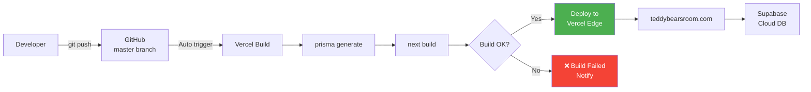

### 10.2 인프라 구성

| 서비스 | 제공자 | 리전 |
|--------|--------|------|
| Hosting | Vercel | Edge (자동) |
| Database | Supabase | Mumbai (`bjnjbbdcwkooswvexiuh`) |
| Auth | Supabase Auth | Mumbai |
| Storage | Supabase Storage | Mumbai |
| DNS | Cloudflare | — |
| SSL | Let's Encrypt (Vercel) | — |
| Domain | teddybearsroom.com | — |

### 10.3 환경변수

| 변수 | 용도 | 위치 |
|------|------|------|
| `NEXT_PUBLIC_SUPABASE_URL` | Supabase API URL | Vercel + `.env.local` |
| `NEXT_PUBLIC_SUPABASE_ANON_KEY` | Supabase 공개 키 | Vercel + `.env.local` |
| `DATABASE_URL` | PostgreSQL (Pooler, port 6543) | Vercel + `.env.local` |
| `DIRECT_URL` | PostgreSQL (Direct, port 5432) | Vercel + `.env.local` |
| `SUPABASE_SERVICE_ROLE_KEY` | Supabase 서비스 키 | Vercel only |

### 10.4 DNS 설정

- `A` record → `76.76.21.21` (Vercel)
- `CNAME` → `cname.vercel-dns.com`

---

## 11. 개발 Phase 로드맵

### Phase 0: 프로젝트 초기화 ✅ 완료

- [x] Next.js 16 + TypeScript + Tailwind 4 프로젝트 설정
- [x] Supabase 프로젝트 생성 + Prisma 7 연동
- [x] Vercel 배포 + 커스텀 도메인
- [x] 디자인 시스템 v2.0 (Light/Dark Mode)
- [x] 핵심 페이지 UI (홈, 상품, 구독, 기부, 소개)
- [x] 장바구니/위시리스트 (Zustand persist)
- [x] Supabase Auth (이메일/소셜)
- [x] API Routes (상품 CRUD, 주문, 사용자)
- [x] 바디 측정 암호화 (pgcrypto bytea)

### Phase 1: 성인인증 + 결제 연동 — 다음

- [ ] NICE 본인확인 (포트원 V2) 연동
- [ ] PortOne V2 + TossPayments 결제 연동
- [ ] 결제 Webhook 처리
- [ ] 빌링키 정기결제 (구독)
- [ ] Vercel Cron 정기결제 스케줄러
- [ ] 환불 프로세스
- [ ] `payments`, `refunds`, `age_verifications` 테이블

### Phase 2: 리뷰 + 쿠폰/포인트 고도화

- [ ] 상품 리뷰 시스템 (별점 + 텍스트 + 이미지)
- [ ] 쿠폰 시스템 (발급, 검증, 적용)
- [ ] 포인트 고도화 (적립 규칙, 사용, 만료)
- [ ] 배송 추적 연동
- [ ] 이메일 알림 (주문 확인, 배송, 리뷰 요청)

### Phase 3: 관리자 대시보드

- [ ] `/admin` 대시보드 UI
- [ ] 상품 관리 (등록, 수정, 삭제)
- [ ] 주문 관리 (상태 변경, 배송 처리)
- [ ] 회원 관리
- [ ] 매출 통계, KPI
- [ ] CS 관리

### Phase 4: 최적화 & 런칭

- [ ] 성능 최적화 (Core Web Vitals)
- [ ] SEO 최적화 (메타데이터, 사이트맵, robots.txt)
- [ ] CSP 헤더 + 보안 강화
- [ ] 에러 모니터링 (Sentry)
- [ ] E2E 테스트
- [ ] 소프트 런칭 → 정식 오픈

---

## 12. 부록

### 12.1 기술 결정 기록 (ADR)

| # | 결정 | 배경 | 일시 |
|---|------|------|------|
| ADR-001 | pgcrypto로 신체정보 암호화 | Privacy-First, DB 레벨 암호화 | 2025-11 |
| ADR-002 | Pass/Fail 사이즈 추천 | 복잡한 점수제 대신 단순 범위 매칭 | 2025-11 |
| ADR-003 | Vercel Cron 정기결제 | 직접 결제 엔진 대신 스케줄러만 구현 | 2025-11 |
| ADR-004 | PASS 본인확인 (SKT CI/DI) | 청소년보호법 성인 확인 의무 | 2025-12 |
| ADR-005 | TossPayments (PortOne V2) | 빌링키 + 일반결제 통합 | 2025-12 |
| ADR-006 | Roommate 단일 Tier MVP | 선택의 역설 해결, 핵심 가치 검증 | 2025-12 |
| ADR-007 | TanStack Query 제거 | Next.js 16 RSC와 중복, Zustand으로 충분 | 2025-11 |
| ADR-008 | Tailwind 4 직접 CSS 변환 | `@layer` 내 `@apply` 제한 우회 | 2025-11 |

### 12.2 참고 링크

- [Next.js 16 Docs](https://nextjs.org/docs)
- [Prisma 7 Docs](https://www.prisma.io/docs)
- [Supabase Docs](https://supabase.com/docs)
- [PortOne V2 Docs](https://developers.portone.io/)
- [TossPayments Docs](https://docs.tosspayments.com/)
- [NICE 본인확인](https://www.nicepay.co.kr/)
- [shadcn/ui](https://ui.shadcn.com/)
- [Zustand](https://docs.pmnd.rs/zustand/getting-started/introduction)

---

> **문서 작성**: Claude Code (2026-02-28)
> **기반**: Prisma 스키마, CLAUDE.md, 소스 코드 구조 분석
